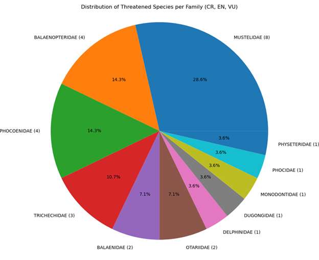

# IUCN Red List Threat Analysis by Taxonomic Family
(SQL + Python + pandas + matplotlib)

## Objective
Identify which taxonomic families contain the highest numbers of threatened species
(Critically Endangered, Endangered, and Vulnerable) using normalized IUCN Red List data.

This project focuses on structuring messy conservation data into a relational format
and extracting biologically meaningful insights to support conservation prioritization.

---

## Key Result
After cleaning and normalizing IUCN hierarchy and country occurrence data, the analysis
shows that threatened species are unevenly distributed across taxonomic families, with
a small subset of families accounting for a disproportionate share of conservation risk.

**Takeaway:** Aggregating threat status at the family level highlights priority taxonomic
groups where conservation and monitoring efforts may have the greatest impact.

---

## What This Project Demonstrates
- Relational database design from real-world biological datasets
- Data cleaning and normalization of large CSV files
- SQL-based aggregation of conservation status
- Python-based visualization for interpretability

---

## Methods (Brief)
- Source data: IUCN Red List hierarchy and country occurrence CSVs
- Cleaning: removed duplicates and nulls, normalized taxonomy tables,
  and stripped hidden characters from categorical fields
- Analysis: SQL queries used to count CR, EN, and VU species per family
- Visualization: matplotlib used to visualize threatened species distribution

---

## Example Output
Distribution of Threatened Species per Family (CR, EN, VU)

---

## Repository Structure
schema/     ER diagram and relational schema  
data/       Raw and cleaned IUCN CSV files  
notebooks/  Jupyter notebooks for wrangling and visualization  
figures/    Generated plots  
reports/    Project writeups and documentation  

---

## Reproducibility
1. Clone the repository
2. Open the notebook in notebooks/
3. Run all cells to reproduce cleaned tables and figures

---

## Potential Extensions
- Geographic aggregation to identify country-level hotspots
- Ranked bar plots instead of pie charts for scalability
- Temporal analysis using assessment year metadata

