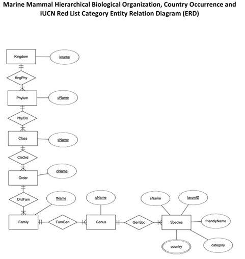

# IUCN Red List Database Project

This project models and analyzes species conservation data from the **IUCN Red List of Threatened Species**.  
It demonstrates database design, data wrangling, and visualization using **SQL, Python (pandas/matplotlib), and relational modeling**.

## Contents
- **schema/** → ER diagram and relational schema for the database
- **data/** → Original IUCN datasets (CSV) and cleaned tables
- **notebooks/** → Jupyter Notebook for data wrangling and visualization
- **figures/** → Generated plots
- **reports/** → Project writeups and final reports

## Database Design
The relational database models:
- **Taxonomy** (kingdom → phylum → class → order → family → genus → species)
- **Conservation status** (critically endangered, endangered, vulnerable, etc.)
- **Country occurrences** (where species are found globally)

## Data Wrangling & Analysis
- Cleaned the raw IUCN hierarchy and country occurrence CSVs.
- Generated normalized tables: `families.csv`, `genus.csv`, `species.csv`, `country_occurrences.csv`.
- Used SQL queries to compute threatened species counts by family.
- Visualized results with Python/matplotlib.

Example result:

## Data Sources
- IUCN Red List species data (downloaded via provided CSVs).  
- Project-specific wrangling and query results generated in Python.

## License
This project is licensed under the MIT License – see the [LICENSE](LICENSE) file for details.

## Acknowledgements
Created as part of coursework at Arizona State University.  
Thanks to instructors and classmates for guidance and collaboration.
